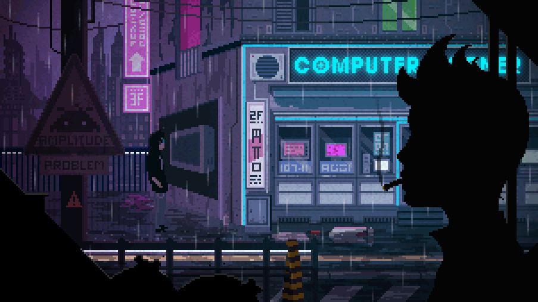

# Hello World! I'm Albert Devada👋
I am a technology enthusiast with a strong curiosity about the digital world. I enjoy learning and experimenting to understand how technology works as a whole. For me, every mistake is an important part of the learning process.

## 🔍 My Interests
I am interested in making systems run better, more efficiently, and continue to improve. 😊

## 📁 Categories
✨ Explore by the following categories:

| Category | Quick Access |
|----------|--------------|
| 🔬 **Experiments & Personal** | [🔗 Explore](https://github.com/albertdveada/Experiments) |
| 📘 **Learning & Tutorials** | [🔗 Explore](https://github.com/albertdveada/Learning) |
| 🛡️ **Backend & Security** | [🔗 Explore](https://github.com/albertdveada/Backend-Security) |
| 🎓 **University Projects** | [🔗 Explore](https://github.com/albertdveada/University_Projects) |

## 🚀 Let's Connect!

---

  <b>© Create by Albert Devada. Built with 💻 and ☕. All rights reserved.</b>

